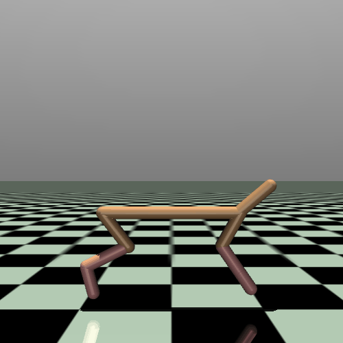

# Zero-One Attack

This repository contains the implementation of the **Zero-One Attack**, an adversarial evaluation method for degrading the performance of reinforcement learning controllers through bounded perturbations in both observation space and activation timing.

---

## Overview

Modern control systems increasingly rely on neural networks and reinforcement learning policies. While these controllers can achieve strong performance, they can also exhibit fragile behavior under small perturbations.

Zero-One Attack evaluates the robustness of such systems by searching for perturbations that cause large performance degradation while remaining within a bounded attack perturbation range.

The attack can target:

- Observation perturbations
- Activation time perturbations
- Combined obs-time perturbations

These attacks help study the safety and robustness of reinforcement learning agents operating in closed-loop environments.

<table>
  <tr>
    <td align="center">
      <b>Clean</b><br>
      <br>
      <sub>No perturbation applied</sub>
    </td>
    <td align="center">
      <b>Zhang's Attack</b><br>
      <br>
      <sub>Previous best attack</sub>
    </td>
    <td align="center">
      <b>Zero-One Attack</b><br>
      <br>
      <sub>Our observation perturbation attack</sub>
    </td>
  </tr>
</table>

---


## Running the Attack

For running the attack:

1. Load a trained controller.
2. Configure attack parameters and perturbation bounds.
3. Run the optimization-based attack.
4. Evaluate the controller performance under the generated perturbation.

Run attack:

```
python opt_attack/custom_sim.py
```
---

## Citation

If you use this repository, please cite the following:

```
@inproceedings{bak2024zeroone,
  title={Zero-One Attack: Degrading Closed-Loop Neural Network Control Systems using State-Time Perturbations},
  author={Bak, Stanley and Bogomolov, Sergiy and Hekal, Abdelrahman and Mata, Andrew and Rahmati, Amir},
  booktitle={ACM/IEEE International Conference on Cyber-Physical Systems (ICCPS)},
  year={2024}
}
```

---

## Notes

This implementation was released as part of the artifact evaluation package, which received the **Best Artifact Evaluation Package Award at ICCPS 2024**.
